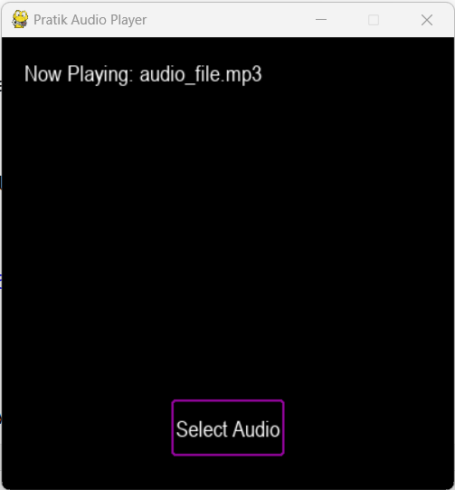

# Pratik-Audio-Player
This is a simple audio player made using Pygame and Tkinter in Python. It allows the user to select an MP3 audio file and play it. The audio player's UI consists of a Pygame window that displays the audio file's name and a button to select the audio file using a file dialog.



## Installation
To run the audio player, you must have Python 3 and Pygame installed on your computer.

* Clone the repository to your local machine.
* Open a command prompt in the project directory and run the following command to install Pygame: ```pip install pygame```.

## Usage
To use the audio player, run the ```audio_player.py``` script using Python. The Pygame window will open, and you can click on the "Select Audio" button to choose an MP3 audio file to play.

## Contributing
Contributions are welcome! Please feel free to submit a pull request.

## License
This project is licensed under the GNU License - see the ```LICENSE``` file for details.
